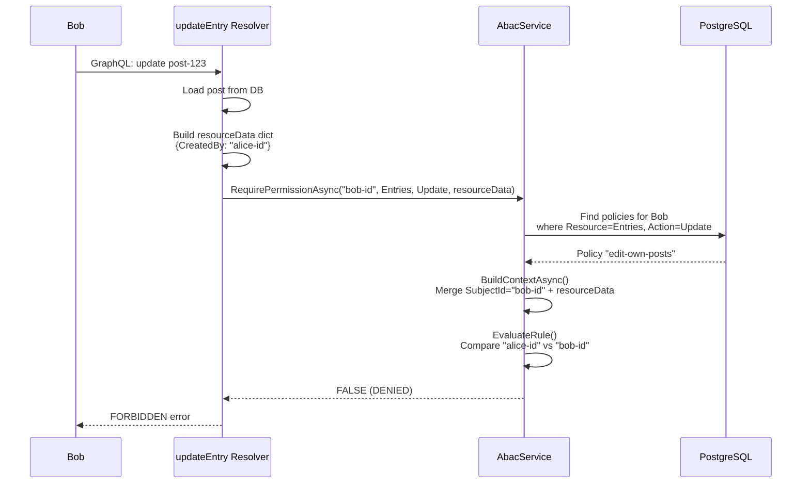

Let me walk you through a **concrete story**, one step at a time, with no jargon skipped.

---

## The Story

**Alice** is an editor at a blog. She wrote a post called *"Why GraphQL Is Great"*.  
**Bob** is also an editor. He did NOT write that post.

There is a rule: *"Editors can only edit their own posts."*

Here is exactly what happens when Alice and Bob each try to edit that post.

---

## Step 1: The Rule Is Stored in the Database

Someone (probably an admin) created this policy in the database:

**Table: `AbacPolicies`**
| Id | Name | Effect | ResourceType | ActionType | Priority | RuleConnector |
|---|---|---|---|---|---|---|
| `p1` | `edit-own-posts` | `Allow` | `Entries` | `Update` | `500` | `And` |

**Table: `AbacPolicyRules`** (belongs to policy `p1`)
| Id | PolicyId | AttributePath | Operator | ContextReferencePath | Order |
|---|---|---|---|---|---|
| `r1` | `p1` | `ResourceEntryCreatedBy` | `EqContextRef` | `SubjectId` | `1` |

Translation of this rule:
> **"Allow** someone to **Update** an **Entry** if the person who **created** that entry is the **same person** as the one making the request."

The `EqContextRef` operator means *"compare two things from the fact sheet"*. It compares `ResourceEntryCreatedBy` against `SubjectId`.

---

## Step 2: The Policy Is Assigned to Alice's Role

**Table: `Roles`**
| Id | Name |
|---|---|
| `role-editor` | `editor` |

**Table: `RolePolicies`**
| RoleId | PolicyId |
|---|---|
| `role-editor` | `p1` |

**Table: `UserRoles`**
| UserId | RoleId |
|---|---|
| `alice-id` | `role-editor` |
| `bob-id` | `role-editor` |

So both Alice and Bob inherited policy `p1` through their `editor` role.

---

## Step 3: Bob Tries to Edit Alice's Post

Bob sends this GraphQL mutation:

```graphql
mutation {
  entries {
    updateEntry(id: "post-123", data: { title: "Hacked!" }) {
      id
    }
  }
}
```

---

## Step 4: The GraphQL Resolver Has a Lock

The resolver for `updateEntry` looks like this:

```csharp
public async Task<Entry> UpdateEntry(Guid id, ...)
{
    // 1. Who is making this request?
    var userId = GetUserIdFromToken();  // "bob-id"
    
    // 2. Load the post from the database
    var entry = await db.Entries.FindAsync(id);  // post-123
    
    // 3. BUILD THE FACT SHEET
    var resourceData = new Dictionary<string, object?>
    {
        ["ResourceEntryId"] = entry.Id.ToString(),           // "post-123"
        ["ResourceEntryCreatedBy"] = entry.CreatedBy.ToString(), // "alice-id"
        ["ResourceEntryStatus"] = entry.Status.ToString(),   // "Published"
    };
    
    // 4. CALL THE BOUNCER
    await abacService.RequirePermissionAsync(
        userId: "bob-id",
        resourceType: BaseResource.Entries,
        action: PermissionAction.Update,
        resourceData: resourceData   // ← the fact sheet
    );
    
    // 5. If we get here, update the post
    entry.Title = "Hacked!";
    await db.SaveChangesAsync();
}
```

Notice: the resolver does NOT decide if Bob can edit. It just gathers facts and asks the ABAC service.

---

## Step 5: The ABAC Engine Loads Policies for Bob

`RequirePermissionAsync` calls `CheckPermissionAsync`, which asks the database:

> *"Find all policies assigned to Bob (directly or via roles) where ResourceType = Entries and ActionType = Update and IsActive = true."*

The database returns: **policy `p1`**.

---

## Step 6: The ABAC Engine Builds the Complete Fact Sheet

`BuildContextAsync` creates a big dictionary by combining:
- Automatic facts (who Bob is)
- Resolver facts (what post he's touching)

```csharp
var context = new Dictionary<string, object?>
{
    // Automatic facts (from the ABAC engine)
    ["SubjectId"] = "bob-id",                           // Who is requesting
    ["SubjectRole"] = "editor",                         // Bob's roles
    ["ActionType"] = "UPDATE",                          // What he's trying to do
    
    // Facts from the resolver (the post details)
    ["ResourceEntryId"] = "post-123",
    ["ResourceEntryCreatedBy"] = "alice-id",
    ["ResourceEntryStatus"] = "Published",
};
```

This dictionary is the **complete truth** the engine knows.

---

## Step 7: The Engine Evaluates the Policy Rules

Policy `p1` has one rule:

| AttributePath | Operator | ContextReferencePath |
|---|---|---|
| `ResourceEntryCreatedBy` | `EqContextRef` | `SubjectId` |

The engine does this:

```csharp
// Get the actual value for "ResourceEntryCreatedBy"
var actualValue = context["ResourceEntryCreatedBy"];   // "alice-id"

// Get the reference value for "SubjectId"
var refValue = context["SubjectId"];                    // "bob-id"

// Compare them
"alice-id" == "bob-id"  →  FALSE
```

The rule does **not** match. Since `RuleConnector = And` and there is only one rule, the **entire policy does not match**.

---

## Step 8: No Allow Policy Matched → Default Deny

The engine checked all Allow policies. None matched. So:

```csharp
return false;  // DENIED
```

`RequirePermissionAsync` sees `false` and throws:

```
FORBIDDEN: Permission denied: Update on Entries
```

Bob gets an error. The post is NOT updated.

---

## Step 9: Alice Tries to Edit Her Own Post

Now Alice sends the exact same mutation. The resolver runs again.

The fact sheet is different this time:

```csharp
var context = new Dictionary<string, object?>
{
    ["SubjectId"] = "alice-id",           // ← different!
    ["SubjectRole"] = "editor",
    ["ActionType"] = "UPDATE",
    
    ["ResourceEntryId"] = "post-123",
    ["ResourceEntryCreatedBy"] = "alice-id",  // ← same as SubjectId!
    ["ResourceEntryStatus"] = "Published",
};
```

Rule evaluation:

```csharp
context["ResourceEntryCreatedBy"]  // "alice-id"
==
context["SubjectId"]               // "alice-id"

→ TRUE → policy matches → ALLOWED
```

The resolver continues, the post is updated.

---

## The Complete Flow in One Diagram



---

## What Confuses People (And Why)

| Confusion | The Reality |
|-----------|-------------|
| *"The `[Authorize]` attribute checks the policy"* | **No.** It only labels the request. The real check is in the resolver calling `AbacService`. |
| *"The enum values are hardcoded checks in the code"* | **No.** They are just string keys in a dictionary. The code never says `if (attribute == ResourceEntryCreatedBy)`. It says `context["ResourceEntryCreatedBy"]`. |
| *"The database policy contains logic"* | **No.** It contains **data**: compare X to Y using Z. The logic is in `EvaluateRule`. |
| *"Creating a policy immediately affects users"* | **Only if assigned.** A policy in the database does nothing until linked to a user or role via `UserPolicies` or `RolePolicies`. |

---

## The Absolute Simplest Summary

1. **Admin writes a rule** in the database: *"Allow update if creator equals current user."*
2. **Admin assigns the rule** to the `editor` role.
3. **Alice and Bob are editors**, so they both inherited the rule.
4. **Bob tries to edit Alice's post.** The resolver gathers facts: *"This post was created by Alice. Bob is asking."*
5. **The engine checks the rule:** *"Does Alice equal Bob?"* → No → **Denied.**
6. **Alice tries to edit her own post.** The resolver gathers facts: *"This post was created by Alice. Alice is asking."*
7. **The engine checks the rule:** *"Does Alice equal Alice?"* → Yes → **Allowed.**

The ABAC engine is just a very fancy way of asking: *"Given these facts, does any rule say this is okay?"*